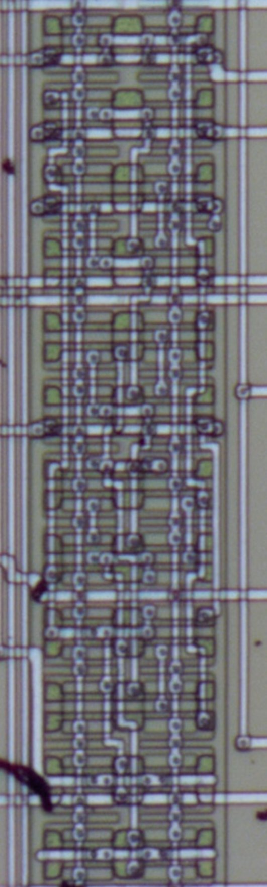

# Fujitsu AV, UHB
## Flip-flop Family
### JKFFNCNR / FJ4
**Negative-edge triggered** JK flip-flop with negative reset

[Photo source](https://siliconpr0n.org/archive/doku.php?id=mcmaster:konami:007782) / Ports from the top: i_RST_n, i_CLK_n, i_J, i_K, o_Q, o_Q_n

 

### JKFFNCNRNS / FJ5
**Negative-edge triggered** JK flip-flop with negative reset and negative set

[Photo source](https://siliconpr0n.org/archive/doku.php?id=mcmaster:konami:007782) / Ports from the top: i_RST_n, i_CLK_n, i_J, i_K, i_SET_n, o_Q, o_Q_n

### JKFFNR / FJD
JK flip-flop with negative reset

Photo by Furrtek / Ports from the top: i_CLK, i_J, i_K, i_RST_n, o_Q, o_Q_n

## Counter Family
### CNTR4NRNLPE / C43
4-bit counter with negative asynchronous reset, negative load, and positive enable

[Photo source](https://siliconpr0n.org/archive/doku.php?id=mcmaster:konami:007782)

