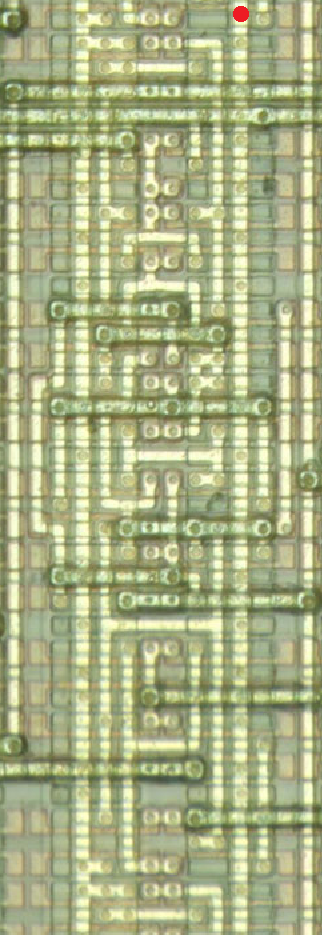
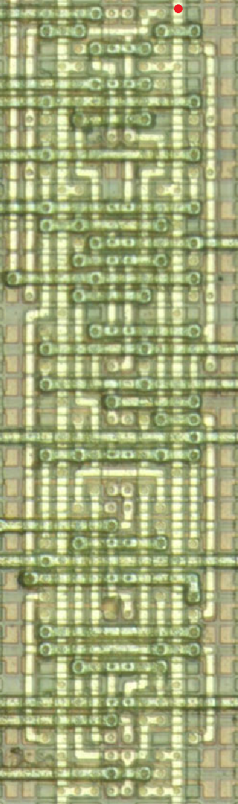

# ASIC cell mugshots
This list is a compilation of ASIC cell mugshots I've found so far. Information is always subject to change. By default, cell names follow the <b>Squid ASIC cell naming convention</b>. I wrote the original name together if I can find it in original document. This may violate copyright, but masking rights only last 10 years, so there shouldn't be a problem - no one equates 80s gate array cell layout works with <i><b>Art</b></i>, right? 

# Squid ASIC cell naming convention
<i>Why Squid? - Watch Shinryaku Ika Musume S1 E1 and come again.</i>

- **INVERTER/BUFFER FAMILY**
    - **INV** - inverter
    - **BUF** - buffer
    - prefix **COMP** - _(e.g. COMPBUF...)_ with complementary output, **ONLY FOR BUF** 
    - suffix **P{n}** - _(e.g. INVP, INVP2...)_ power inverter, n can represent the number of parallel transistors, or it can simply represent the units of output from that ASIC.
    - suffix **D** - _(e.g. INVD, BUFD...)_ with RC delay

- **AND/OR FAMILY**
    - **NAND{n}/NOR{n}** - n specifies the number of input ports
    - **AND{n}/OR{n}** - n specifies the number of input ports
    - prefix **COMP** - _(e.g. COMPOR2...)_ with complementary output
    - suffix **P{n}** - _(e.g. OR2P, NAND2P...)_ power inverter, n can represent the number of parallel transistors, or it can simply represent the units of output from that ASIC.
    - suffix **OD** - _(e.g. AND2OD...)_ open drain output. If the logic output is zero, the transistor pulls that signal to GND. If it is 1, the output is Hi-Z and the line is _released_.

- **AND-OR FAMILY**
    - **AOI{pqr...}** - AND-OR-INVERTER gate, p, q, r... specifies the number of inputs for each AND. _(e.g. AOI223 = ~{AND2|AND2|AND3})_
    - **OAI{pqr...}** - OR_AND-INVERTER gate, p, q, r... specifies the number of inputs for each OR. _(e.g. AOI223 = ~{OR2|OR2|OR3})_
    - **AO{pqr...}** - AND-OR gate, p, q, r... specifies the number of inputs for each AND.
    - **OA{pqr...}** - OR_AND gate, p, q, r... specifies the number of inputs for each OR.

- **EXCLUSIVE OR FAMILY**
    - **XOR{n}** - n specifies the number of input ports, normally 2
    - **XNOR{n}** - n specifies the number of input ports, normally 2

- **MULTIPLEXER FAMILY**

- **COMPLEX**
    - Often people create strange gates. This practice is most common in NMOS chips, but sometimes CMOS chips also create strange gates. See _AOI222(MF23 wired)_

To find the input and output ports, see the svgs I uploaded. You can find the specific cell with Ctrl+F and I basically write the names of all the cell input/output ports.

# NEC CMOS-5 6T array

# Toshiba TC2xSC series standard cell
* TC21SC: 2.0um 1.5ns standard cell ASIC, no macros or embedded memory, <10k gates
* TC22SC: 2.0um 1.5ns standard cell ASIC with embedded memory or multiplier, <10k gates
* TC23SC: 1.5um 1.0ns standard cell ASIC with analog/CPU macros, <50k gates
* TC24SC: 1.0um ?
* TC25SC: 0.8um ?

A standard cell type ASIC developed in-house by Toshiba. Unlike the TC13/15/17G 4T gate array series, it was possible to place embedded ROM and RAM. The family was found in the 2.0-0.7um process node and was all double metal. The M2 is placed high that the polysilicon is not visible, so delayer is required in most cases. Konami SCC didn't require top metal shaving, but the sound chip from Roland or the math chip named SEI300 from Seibu Cup Soccer would definitely require delayering process.

## Combinational
### AND3 / AN3

### AND4 / AN4

### AOI222P(MF23 wired) / AO5

# Toshiba TC15/17/19 4T array

# Toshiba/LSI Logic 4T array
## Flip-flops
### SDFF / FD1SP

## Multiplexers
### MUX81P / MUX81P(13 cells)

# Yamaha single row standard cell(YM3xxx)

# Yamaha double row standard cell(YM6xxx, F7xxxx)