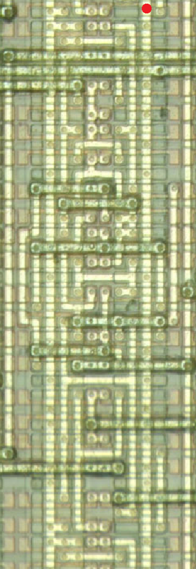

# NEC CMOS-5 6T array

# Toshiba TC21SC/TC22SC standard cell

# Toshiba TC15/17/19 4T array

# Toshiba/LSI Logic 4T array
## Flip-flops
### FD1SP

## Multiplexers
### MUX81P(13cells)

# Yamaha single row standard cell(YM3xxx)

# Yamaha double row standard cell(YM6xxx, F7xxxx)