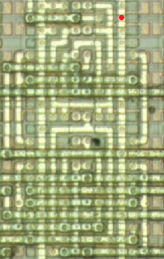
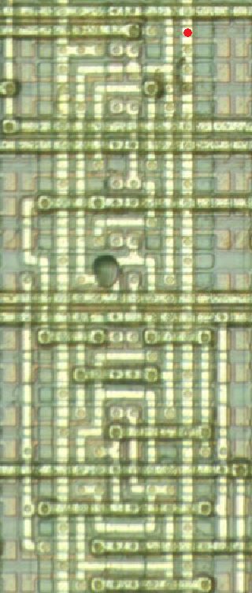
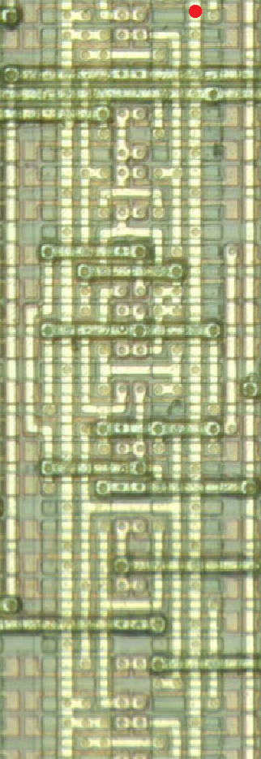

# LSI Logic LCA10/100k gate array
## Inverter/buffer Family

## AND/OR Family
### NAND4P / ND4P
**Warning**: Two different configurations exist!

 

Cell count = 4

## Multiplexer Family
### MUX41P / MUX41P
**Warning**: Two different configurations exist! The databook says it takes 7 cells, but what I found only occupies 6.

Cell count = 6

### MUX81P / MUX81P
**Warning**: Two different configurations exist! The databook says it takes 15 cells, but what I found only occupies 13.

Cell count = 13

## Adder Family
### FA1P / FA1P

Cell count = 10

## Flip-flop Family
### DFF / FD1

Cell count = 7

### DFFP / FD1P

Cell count = 8

### DFFNRP / FD2P

Cell count = 9

### SDFF / FD1S

Cell count = 9

### SDFFP / FD1SP

Cell count = 10

