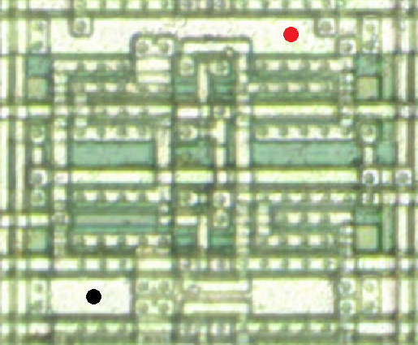

# NEC CMOS-5 gate array
## Inverter/buffer Family
## NAND/NOR Family
### NAND8 / F308

Cell count = 4

## AND/OR Family
### AND2 / F312

Cell count = 1

### OR2 / F212

Cell count = 1

## AND-OR Family
### OAI21 / F431

Cell count = 1

## Exclusive OR Family
### XOR2 / F511

Cell count = 2

### XNOR2 / F512

Cell count = 2

## Decoder Family
### DEC24NO / F561
2-to-4 decoder with negative output

Cell count = 4

### DEC24NONE / F981
2-to-4 decoder with negative output and negative enable

Cell count = 6

## Latch Family
### QDLPE / F901
Quad transmission gate D-latch with positive enable

Cell count = 10

### ODLPE / F903
Octal transmission gate D-latch with positive enable

Cell count = 14

## Flip-flop Family
### DFFNR / F615
D Flip-flop with negative reset(clear)

Cell count = 5

### DFFNS / F616
NEC CMOS-5 D Flip-flop with negative set(preset)

Cell count = 5

## Counter Family
### UPCNTR4NR / F962
4-bit up counter with asynchronous negative reset

Cell count = 24
