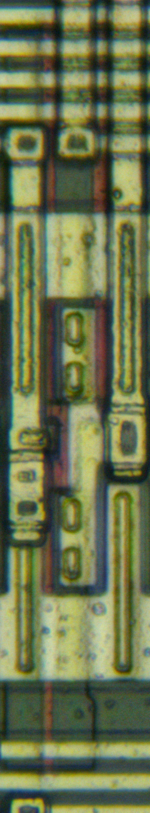
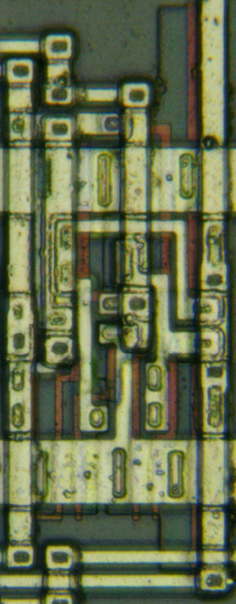
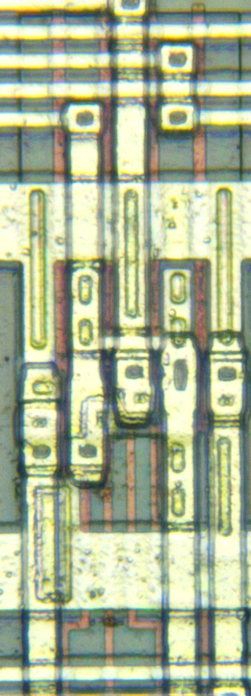
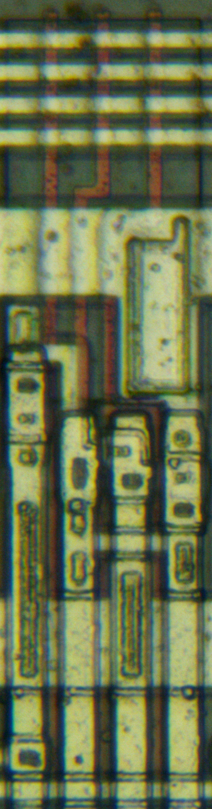
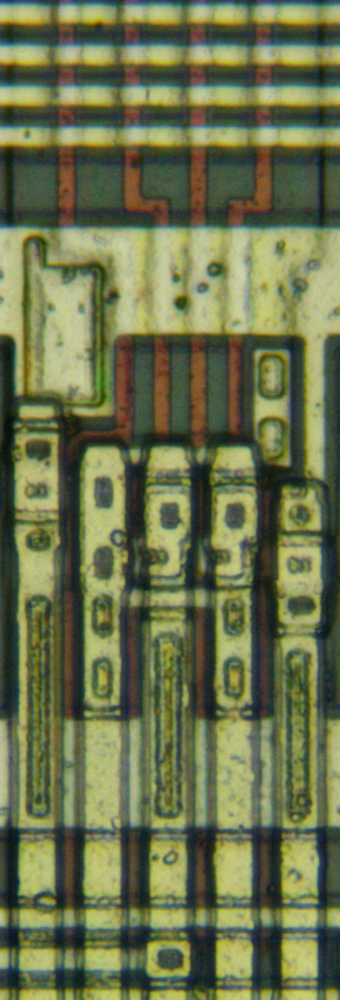
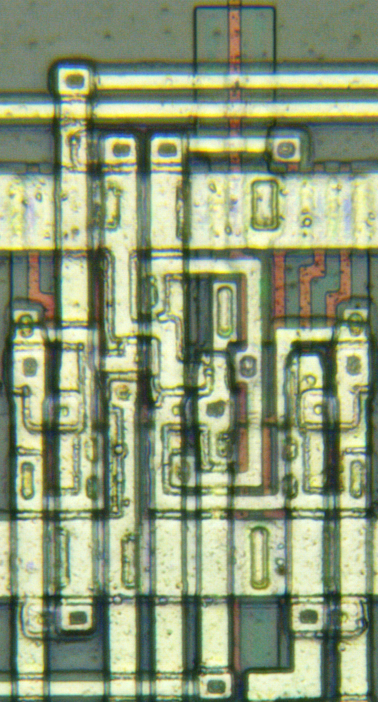
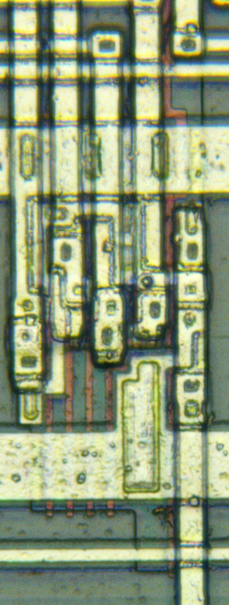
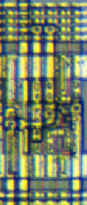
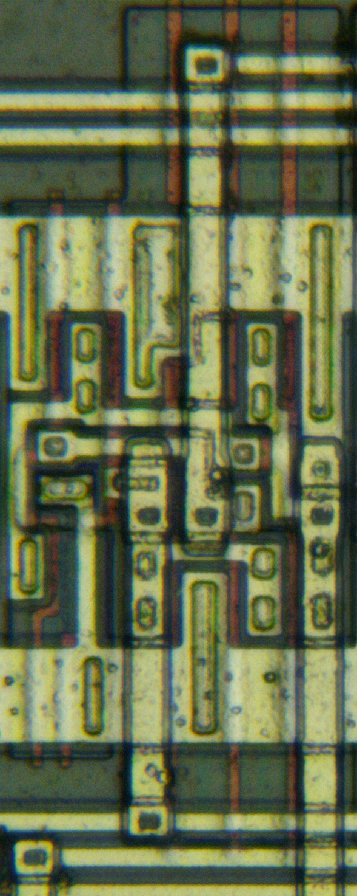

# Toshiba TC2xSC series standard cell
## Combinational
### INVP / IVA

### TSBPEN / BTS4

### NAND4 / ND4

### NAND8 / ND8

### NOR3 / NR3

### NOR4 / NR4

### NOR6 / NR6

### OR2 / OR2

### AND3 / AN3

### AND4 / AN4

### AOI22 / AO2

Y = ~|{A1&A2, B1&B2}

### AOI222P(MF23 wired) / AO5

inverting 2 of 3 majority gate; Y = ~|{A&B, A&C, B&C}

### XOR2 / EO

### XNOR2 / EN

