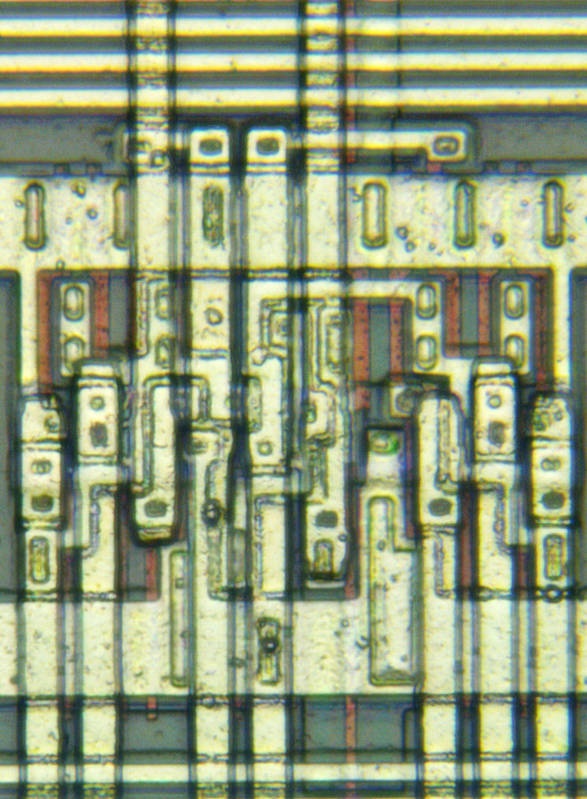
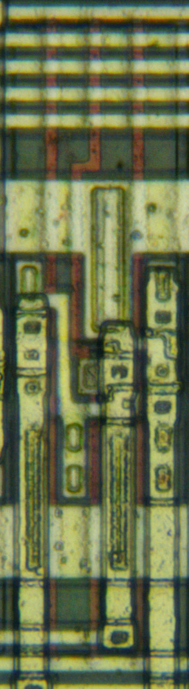
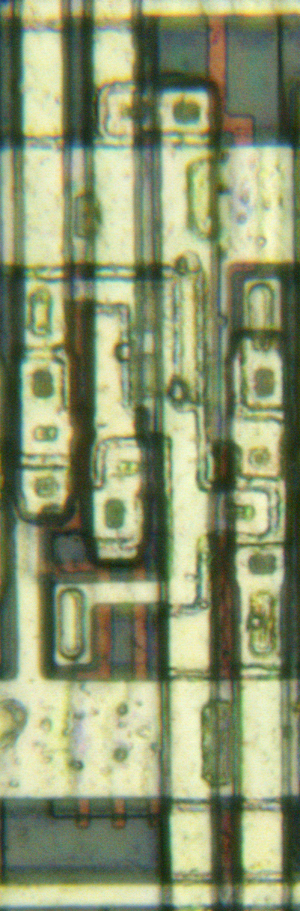
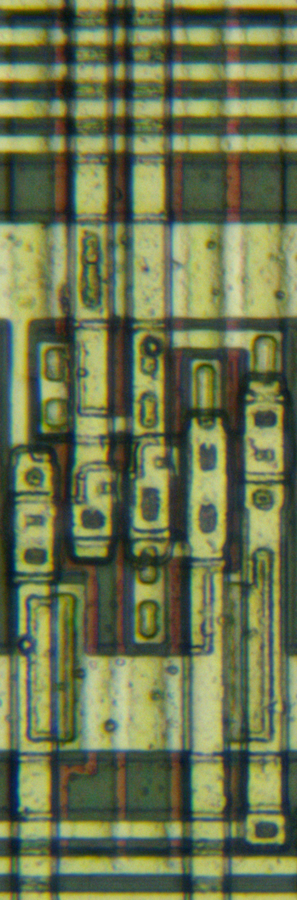
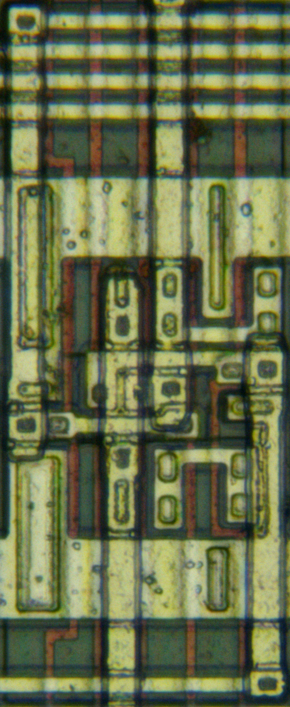
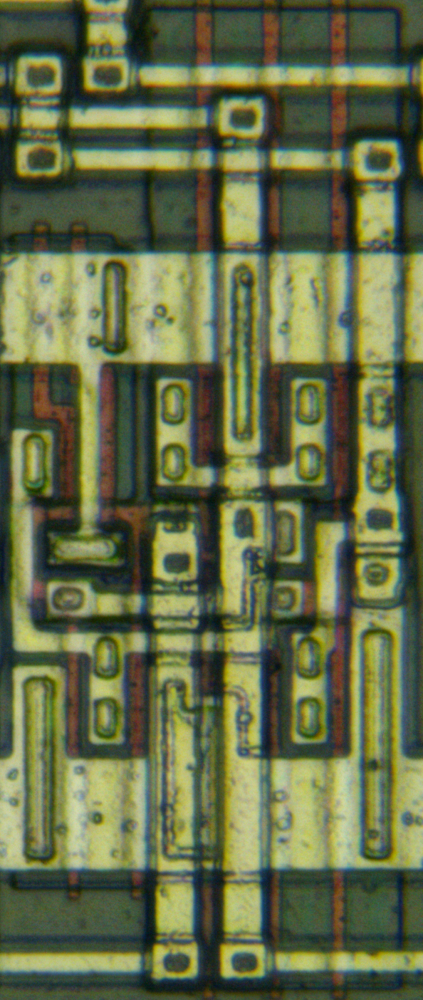

# Toshiba TC2xSC series standard cell
## Inverter/buffer Family
### INVP / IVA
A power inverter with parallel P-ch transistors

TC22SC mugshot

## Tri-state inverter/buffer Family
### TSBPE / BTS4

TC22SC mugshot

## AND/OR Family
### NAND4 / ND4

TC22SC mugshot

### NAND8 / ND8

TC22SC mugshot

### NOR3 / NR3

TC22SC mugshot

### NOR4 / NR4

TC22SC mugshot

### NOR6 / NR6

TC22SC mugshot

### OR2 / OR2

TC22SC mugshot

### AND3 / AN3

TC22SC mugshot

### AND4 / AN4

TC22SC mugshot

## AND-OR Family
### AOI22 / AO2
Y = ~|{A1&A2, B1&B2}

TC22SC mugshot

### AOI222(MF23 wired) / AO5
inverting 2 of 3 majority gate; Y = ~|{A&B, A&C, B&C}

inverting 2 of 3 majority gate; Y = ~|{A&B, A&C, B&C}

## Exclusive OR Family
### XOR2 / EO

inverting 2 of 3 majority gate; Y = ~|{A&B, A&C, B&C}

### XNOR2 / EN

inverting 2 of 3 majority gate; Y = ~|{A&B, A&C, B&C}

## I/O drivers