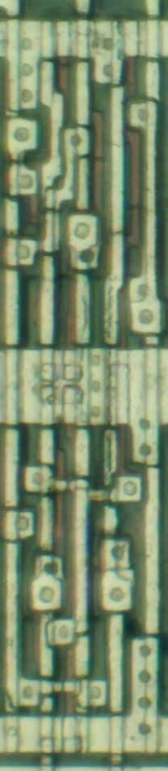
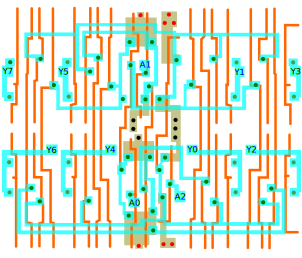

# Yamaha YM6xxx, F7GA, FDGA
## Inverter/Buffer Family
### INV
Inverter
<p align=center></p>

### INVP
Inverter with high drive power(dual p-ch transistors)
<p align=center> </p>

### INVP2
Inverter with high drive power(quad p-ch, dual n-ch transistors)
<p align=center> </br>R800(1.2um) / YM6063(1.5um)</p>

### BUF
Buffer
<p align=center></p>

### BUFP2
Buffer with high drive power(quad p-ch, dual n-ch transistors)
<p align=center></p>


## Tri-state Inverter/Buffer Family
### TSB4NE
Quad tri-state buffer with negative output enable
<p align=center></p>

### TSB8NE
Octal tri-state buffer with negative output enable
<p align=center></br></p>

### TSBP8NE
Octal tri-state buffer with negative output enable and high drive power(parallel p-ch transistors)
<p align=center></p>

## NAND/NOR Family
### NAND2
2-input NAND
<p align=center> </br>R800(1.2um) / YM6063(1.5um)</p>

### NAND4
4-input NAND
<p align=center></p>

### NAND6
6-input NAND
<p align=center></p>

### NAND8
8-input NAND
<p align=center></p>

### NOR2P
2-input NOR with high drive power(parallel p-ch transistors)
<p align=center></p>

### NOR3P
3-input NOR with high drive power(parallel p-ch transistors)
<p align=center> </br>YM6063(1.5um) / GA20(1.5um)</p>


## AND/OR Family
### AND2
2-input AND
<p align=center></p>

### AND3
3-input AND
<p align=center> </br>R800(1.2um) / YM6063(1.5um)</p>

### AND4
4-input AND
<p align=center></p>

### AND8P
8-input AND with high drive power(parallel p-ch transistors)
<p align=center> </br>R800(1.2um) / YM6063(1.5um)</p>

### OR2P
2-input OR with high drive power(parallel p-ch transistors)
<p align=center></p>

### OR8
8-input OR
<p align=center></p>

## AND-OR Family
### OAI21
OR2 and wire into NAND2
<p align=center></p>

### AO22
two AND2s into OR2
<p align=center></p>

### AO2222
four AND2s into OR4(= four NAND2s into NAND4)
<p align=center></p>

### AO22222222
eight AND2s into OR8(= four AOI22s into NAND4)
<p align=center></p>

## Exclusive-OR Family
### XOR2
2-input XOR
<p align=center> </p>

## Decoder Family
### DEC24
2-to-4 decoder
<p align=center> </p>

### DEC38
3-to-8 decoder
<p align=center> </p>


## Multiplexer Family
### MUX21
2-to-1 multiplexer
```verilog
wire Y = S ? IN1 : IN0;
```
<p align=center></p>

### MUX214
Quad 2-to-1 multiplexer
<p align=center></p>

### MUX41
4-to-1 multiplexer
<p align=center> </p>


## Adder Family
### FA4
4-bit full adder
<p align=center></br></p>


## Latch Family
### DL4PE
D latch with positive enable
<p align=center> </p>
<p align=center><i>not delayered, best guess</i></p>


## Flip-flop Family
### DFFPLNOE
D flip-flop with positive load and negative output enable, **inverted output only**
<p align=center> </p>
<p align=center><i>not delayered, best guess</i></p>

### DFFPL
D flip-flop with positive load
<p align=center> </p>
<p align=center><i>not delayered, best guess</i></p>

### DFFPSRPL
D flip-flop with positive **synchronous reset** and positive load
<p align=center> </p>
<p align=center><i>not delayered, best guess</i></p>

### DFF8NRNOE
Octal D flip-flop with negative reset and negative output enable
<p align=center></br></p>


## Shift Register Family
### SR4NR
4-bit shift register with negative reset
<p align=center></p>


## Counter Family
### CNTR1PR
Cascadable 1-bit counter with positive reset
<p align=center> </br>R800(1.2um) / YM6063(1.5um)</p>

### ACC1PR
Cascadable 1-bit accumulator with positive reset
<p align=center></p>

### ACC1NL
Cascadable 1-bit accumulator with negative load; D port to preload data, A port for accumulation
<p align=center> </p>


## Miscellaneous
### VDD
Tie node to the Vdd
<p align=center></p>

### GND
Tie node to the GND
<p align=center></p>

### PG8PBE
8-bit odd parity generator/checker with bit enables
```verilog
wire P = ^{D[7:0] & BE[7:0]};
```
<p align=center></p>

### PDET
Positive edge detector
```verilog
reg Z;
always @(posedge CLK) Z <= A;
wire DET = ~Z & A;
```
<p align=center> </p>