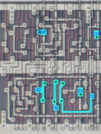

# Yamaha YM6xxx, F7GA, FDGA
## Inverter/Buffer Family
### INV
Inverter

### INVP
Inverter with high drive power(parallel p-ch transistors)

 

## Tri-state Inverter/Buffer Family
### TSB4NE
Quad tri-state buffer with negative output enable

### TSB8NE
Octal tri-state buffer with negative output enable

## AND/OR Family
### AND8P
8-input AND with high drive power(parallel p-ch transistors)

  R800(1.2um) / YM6063(1.5um)

## AND-OR Family
### OAI21
2-wide 1-2 input OR into NAND

## Decoder Family
### DEC24
2-to-4 decoder

 

## Multiplexer Family
### MUX41
4-to-1 multiplexer

 

### MUX421
Quad 2-to-1 multiplexer; Y = S ? IN1 : IN0

## Flip-flop Family
### DFFPLNOE
D flip-flop with positive load and negative output enable, **inverted output only**

 

<i>not delayered, best guess</i>

### DFFPL
D flip-flop with positive load

 

<i>not delayered, best guess</i>

### DFFPSRPL
D flip-flop with positive **synchronous reset** and positive load

 

<i>not delayered, best guess</i>

### DFF8NRNOE
Octal D flip-flop with negative reset and negative output enable

## Counter Family
### CNTR1PR
Cascadable 1-bit counter with positive reset

## Miscellaneous
### ACC1PR
Cascadable 1-bit accumulator with positive reset

### ACC1NL
Cascadable 1-bit accumulator with negative load; D port to preload data, A port for accumulation

 
