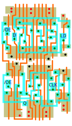

# Yamaha YM6xxx, F7GA, FDGA
## Flip-flop Family
### DFFPLNOE
D flip-flop with positive load and negative output enable, **inverted output only**

 

<i>"not delayered, best guess"</i>

### DFFPSRPL
D flip-flop with positive **synchronous reset** and positive load

 

<i>"not delayered, best guess"</i>

## Counter Family
### CNTR1PR
Cascadable 1-bit counter with positive reset

